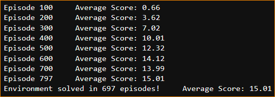
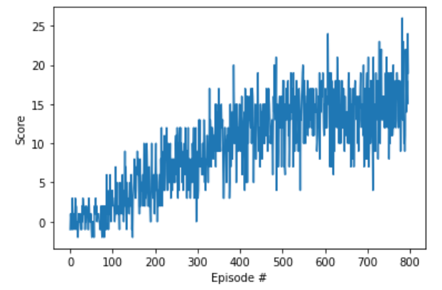

# Report of the Project: Navigation and collect bananas

 ## Learning algorithm

 ### Deep Q Learning

 The learning algorithm behind the agent is a combination of Q Learning and nerual network. This combination is called Deep Q-Networks.

 Q Learning is value-based method from reinforcement learning and represents the optimal action-value function by a Q-table.
 In deep Q learning, the table is replaced by a neural network. However, reinforcement learning is unstable when nerual networds is used.
 
 To address the problem, DeepMind developed experience replay and fixed Q Target in 2015.

 #### Experience replay and Fixed Q-Targets
 > when the agent interacts with the environment, the sequence of experience tuples can be highly correlated. If the Q learning algorithm learns these experience tuples in equential order, the action value oscillating or diverging catastrophically due to the correlation. To address, a replay buffer is kept to contains experience tuples and added gradually as the agent interacting with environemt. The experience replay sample small batch from the buffer randomly for learning, instead sequenced experience tuples.
 Since the predicted Q values function is generated based on itself, the target Q network and predicted Q network is highly correlated which cause instablity. To solve the problem, the target Q network is copyied separately from the Q network, but updated periodically instead of each time step.

#### Network architecture

```
Input nodes (37) -> Fully Connected Layer (128 nodes, Relu activation) -> Fully Connected Layer (64 nodes, Relu activation) -> Ouput nodes (4)
```

#### Training parameter

```
BUFFER_SIZE = int(1e5)  # replay buffer size
BATCH_SIZE = 64         # minibatch size
GAMMA = 0.99            # discount factor
TAU = 1e-3              # for soft update of target parameters
LR = 5e-4               # learning rate 
UPDATE_EVERY = 4        # how often to update the network
```

## Training results





The environment was solved in 797 episodes.


## Ideas for future work

From Deepmind, there are two enhancements would improve the agent's performance.

### Prioritized Experience Replay

Instead of sampling experience buffer uniformly, more important buffer have higher priority and thus sampled with higher probability.
To do so, the replay buffer is stored along with its calculated TD error. The bigger its error, the more we expect to learn and higher sampling probability is assigned.
As a result, more important experiences are replayed more frequently and thus the agent learn more efficiently.

### Dueling DQN

In dueling DQN, the network architecture differs. In the fully connected-layers, there are two stream, and finally combined to one Q-values function.
The first estimates the state value function, and the second estimates the advantage for each action at that state.
Since the values of most state don't vary a lot across actions, the state value function directly measures these value. On the other hand, the advantage function measures the difference actions make in each state.
With the use of two stream, the training is accelerated.